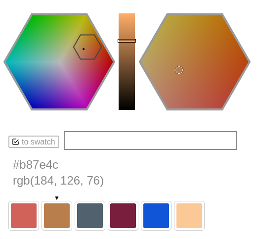

# Color Spinner


## What is this?

It's a web-based color picker. I'm working on a swatch manager that lets
you group colors and move them around a grid so that you can more easily
compare and refine shades. I also have a direct input box that parses
colors in hexadecimal format.


## What's working right now?

Currently you can input a 32-bit RGB color as a three-character or
six-character hexadecimal code with or without a leading [hash
character](https://en.wikipedia.org/wiki/Number_sign).

For example, any of the following can be entered to specify the
color that is also known as rgb(255, 170, 187):

```
fab
#fab
ffaabb
#ffaabb
```



## What else can I do?

You can reload the page to see four new random colors, which might be
interesting if you're trying to come up with a new color palette for a
design project.

After entering a hex code, you can edit it in the input box. You'll see
instant updates to the active color swatch, which is marked with a small
black triangle. To copy the swatch, hover over it and click on the right
arrow. To delete the swatch, hover and click on the X.

To make another swatch active, click on it. To deactivate the active
swatch, click on the small black triangle. Beware: when there is no
active swatch, every editing action causes a new swatch to be created.

You can edit the color using the visual controls at top. Click and drag
in the left hexagon to move the zoomed view, which is shown in the right
hexagon. Click on a point in the right hexagon to select a color. Use
the slider between the two hexagons to adjust the color value.


## What's coming next?

- fewer bugs
- better visual controls
- grab and move color swatches
- make color groups
- save colors

